# Sanity CMS audit + rebuild plan (v2)

**Canonical editor brief:** [sanity-cms-rebuild-guide.md](./sanity-cms-rebuild-guide.md)  
**Studio branding:** Project title **Rellia Web Studio** · Drawer header **Website Editor**

This document audits the current setup and defines the rebuild path for an ultra-minimalist, editor-first CMS that stays stable when the frontend evolves.

---

## Goals

- Reorderable **sections** on pages (one `section*` system end-to-end)
- Rich headings/subheadings (`portableRichText` / `inlineHeroHeadline`)
- Visual editing (Presentation) **after** section schemas and GROQ are stable
- Easy editing for programs, events, stories, advisors, alumni companies
- **People** hub for directory content **and** logo-scroll marquees (Investors + Alumni)
- **Page visibility** on every routed page: live, hidden, or placeholder
- **Analytics in Studio:** Looker Studio iframe only — **no** GA/GSC backend plugins or Express proxies

---

## 1) What’s wired today (keep)

| Layer | Location | Notes |
|-------|----------|--------|
| Studio | `website-cms/` | Sanity v5, `structureTool`, `presentationTool`, `@sanity/vision` |
| Secure reads | `POST /api/sanity/query` | Whitelisted `queryId` in `shared/cms/sanityQueryRegistry.ts` |
| Preview | `server/index.ts` | `perspective: 'drafts'` + `stega` when Presentation cookie/header present |
| Sections (live) | `section*` + `PageRenderer.tsx` | **Use this** — not `pageBuilder` / `heroSection` |
| Investors logo scroll | `networkInvestorsPage.logoMarquee` | Wired in GROQ + `Investors.tsx` |
| Founders logo scroll | Hardcoded `LogoMarquee` | **Not in CMS yet** — plan adds `logoMarquee` to founders page doc |

---

## 2) Datasets

- **`preview`** — staging / Vercel preview / default Studio dataset  
- **`production`** — www.relliahealth.com  
- Promote via `scripts/promote-preview-to-production.ts` after approval  

Always audit/export dataset content **before** dropping or renaming fields.

---

## 3) Known problems

1. **Two section systems** — `section*` (rendered) vs `pageBuilder` (mostly dead in UI)
2. **Singleton field sprawl** — hard to reorder without `sections[]`
3. **Investors logo scroll** lives on a **Pages** landing doc; editors expect it under **People**
4. **Alumni/founders logo scroll** not editable in CMS
5. **No page-level hide / placeholder** control in Studio
6. **Presentation** broken until env + Phase 5 (after sections stable)

---

## 4) Target Studio sidebar

```mermaid
flowchart TB
  root[Website Editor]
  root --> site[Site]
  root --> pages[Pages]
  root --> collections[Collections]
  root --> people[People]
  root --> support[Support]
  root --> analytics[Analytics]

  site --> siteSettings[Site settings]
  site --> globalSettings[Global settings]
  site --> navigation[Navigation]

  pages --> corePages[Home About Careers FAQ Contact ...]
  pages --> landings[Programs Events Stories landings]

  collections --> programs[Programs]
  collections --> events[Events]
  collections --> stories[Stories + Categories]
  collections --> modular[Modular pages]

  people --> advisorsHub[Advisors]
  people --> foundersHub[Founders / Alumni]
  people --> investorsHub[Investors]

  advisorsHub --> advisorList[All advisors]
  advisorsHub --> advisorTax[Filter tags + Filter groups]

  foundersHub --> companyList[Companies]
  foundersHub --> foundersPage[Founders page + Logo scroll]
  foundersHub --> founderTax[Specialties + Filter groups]

  investorsHub --> investorsPage[Investors page + Logo scroll]

  support --> cmsGuide[How to use this CMS]

  analytics --> looker[Performance dashboard - Looker iframe]
```



**Rules**

- No top-level Taxonomy tab — filters live under the relevant **People** subtree.
- **Collections** = Programs, Events, Stories (+ categories), Modular pages only.
- **People → Investors** = edit `networkInvestorsPage` (especially **Logo scroll** array: add, remove, reorder).
- **People → Founders** = companies + **Founders page** doc with new **Logo scroll** (alumni/portfolio marquee), same pattern as investors.
- Clear doc titles (no `(/programs)` in labels).
- **Analytics** = `SANITY_STUDIO_LOOKER_EMBED_URL` iframe panel only.

---

## 5) Page visibility (every routed page)

Add a shared **Publishing** group on **every page singleton** (and modular `page` if public):

| Field | Type | Purpose |
|-------|------|---------|
| `pageVisibility` | `string` radio | `live` · `hidden` · `placeholder` |
| `placeholderTitle` | `string` | Shown when `placeholder` (e.g. “Coming soon”) |
| `placeholderMessage` | `text` | Short body copy |
| `placeholderCtaLabel` / `placeholderCtaHref` | optional | Link back to home or contact |

**Frontend contract** (single helper used by all routes):

- `live` — render normal page from CMS + defaults merge
- `hidden` — return 404 (or exclude from nav via separate nav toggle if needed)
- `placeholder` — render a simple branded placeholder layout (no full marketing page)

Apply to: `homePage`, `aboutPage`, `careersPage`, `faqPage`, `contactPage`, `paymentPage`, `consultingPage`, all network landings, `programsLandingPage`, `eventsLandingPage`, `storiesPage`, and public `page` documents.

**Desk:** show `pageVisibility` in document list subtitle where useful (e.g. “Hidden”, “Placeholder”).

---

## 6) Logo scroll schema (Investors + Alumni)

Reuse the existing investor marquee object shape from [`networkInvestorsPage.ts`](../website-cms/schemaTypes/documents/networkInvestorsPage.ts):

```ts
logoMarquee[]{
  name,
  logo,      // image required
  href?,     // optional link
}
```

| Page doc | Today | Target |
|----------|--------|--------|
| `networkInvestorsPage` | `logoMarquee` in CMS, queried in GROQ | Keep; primary edit surface under **People → Investors** |
| `networkFoundersPage` | No `logoMarquee`; hardcoded `LogoMarquee` on site | Add `logoMarquee` + GROQ + pass logos into `Founders.tsx` |

Array options: `sortable: true`, per-item preview (`name` + logo thumbnail).

Optional later: shared object type `logoMarqueeItem` to avoid duplication.

---

## 7) Sections rule (Phase 3)

- One system: **`sections[]`** of `section*` types → `PageRenderer`
- Retire `pageBuilder` from editor menus after migration
- **Every** section object must have:
  - `internalLabel` (editor-only), and/or
  - `preview` that shows a readable title (e.g. **Hero: Summer Launch**, not generic “Section: Hero”)
- GROQ: use shared `pageSectionsFragment` in `shared/cms/groqQueries.ts`
- Types: extend `CmsPageSection` in `shared/cms/types.ts` only when adding new `_type`s

---

## 8) Plugins (minimal)

| Plugin | Use |
|--------|-----|
| `structureTool` | Custom desk |
| `presentationTool` | Visual editing (Phase 5) |
| `@sanity/vision` | Dev GROQ |
| `sanity-plugin-seofields` | Phase 7 — replace/augment custom `seo` object; character-count hints |
| **Not used** | `sanity-plugin-ga-dashboard`, custom Express analytics routes, Google service-account JSON on server |

**Analytics (Phase 7):** native Studio component [`LookerStudioPanel`](../website-cms/studio/LookerStudioPanel.tsx) — full-height iframe, env `SANITY_STUDIO_LOOKER_EMBED_URL` only.

---

## 9) Data safety & seeding (before schema breaks)

1. Export or snapshot current `preview` / `production` documents (Vision export or `sanity documents export`).
2. Update [`scripts/sanity-seed.ts`](../scripts/sanity-seed.ts) to:
   - Preserve stable singleton IDs (`homePage`, `navigation`, …)
   - Migrate [`shared/careersOpenRoles.ts`](../shared/careersOpenRoles.ts) → `careersPage.openRoles`
   - Seed `networkFoundersPage.logoMarquee` from current hardcoded marquee logos (if any)
   - Copy existing `networkInvestorsPage.logoMarquee` as-is
   - Do **not** drop legacy fields until frontend reads new fields
3. Run seed on **preview** → verify site → promote or patch production.

---

## 10) Implementation phases & checklist

| Phase | Status | Scope |
|-------|--------|--------|
| **1** Desk + branding + list UX | **Done** | `deskStructure`, “Website Editor”, nav list rows, previews, Support + Looker panels |
| **1b** People desk: Investors + logo surfaces | Planned | Move Investors page under **People**; expose logo scroll prominently |
| **2** Field hints | Planned | `fieldHints.ts`, word-count descriptions |
| **3** Sections unification | Planned | `sections` everywhere; `internalLabel` + previews on all section types; GROQ + types |
| **5** Presentation / stega | Planned | **After Phase 3** — env checklist, draft-mode, Visual Editing overlays |
| **4** Careers open roles | Planned | `careersPage.openRoles` + seed |
| **6** Support docs | Planned | Expand `cmsGuide` or Support panels |
| **7** SEO plugin | Planned | `sanity-plugin-seofields` — **not** GA dashboard |
| **7b** Looker Studio | Partial | iframe panel exists; set embed URL in Studio env |
| **8** Page visibility + founders logo scroll | Planned | `pageVisibility` on all pages; `logoMarquee` on founders; frontend guards |
| **9** Legacy cleanup | Planned | Hide `pageBuilder`, hidden advisor aliases, orphan types |

### Suggested execution order

1. Phase **1b** — People → Investors / Founders desk + logo scroll schema  
2. Phase **2** — Field hints  
3. Phase **3** — Sections + GROQ + `PageRenderer`  
4. Phase **5** — Presentation (after 3)  
5. Phase **8** — Page visibility + founders marquee wiring  
6. Phase **4** — Careers roles + seed (with data audit first)  
7. Phase **6** — Support docs  
8. Phase **7** — SEO plugin  
9. Phase **9** — Legacy cleanup  

---

## 11) Phase 5 — Presentation (reference)

WebSocket `preview?tag=sanity.studio` warnings are often non-fatal. Fix **“Unable to connect to visual editing”** with:

- `SANITY_API_READ_TOKEN`, `SANITY_STUDIO_PREVIEW_URL`, `SANITY_STUDIO_URL`
- Matching `preview` dataset on Studio + preview deploy
- `VisualEditingOverlay` + `/api/draft-mode/enable` + stega on `/api/sanity/query`

Do **not** tune Presentation field mappings until Phase 3 section/GROQ shape is final.

---

## 12) Success criteria

- **People → Investors** — add/remove/reorder logo scroll; previews show logo thumbnails  
- **People → Founders** — same for alumni logo scroll; companies + taxonomy under one hub  
- **Every page** — `live` / `hidden` / `placeholder` works on site and in Studio  
- **Sections** — reorderable; each block labeled clearly in Studio  
- **Analytics** — Looker iframe only; no GA plugin or server proxy  
- **Presentation** — click-to-edit after Phase 3 + 5  
- No Studio block types that the frontend does not render  

---

## 13) Historical audit sections (reference)

<details>
<summary>Original repo layout, dataset, and section-system audit (unchanged detail)</summary>

### Studio app

- **Studio** lives in `website-cms/`
  - `sanity.config.ts`: structureTool, presentationTool, vision
  - `schemaTypes/*`, `deskStructure.ts`, `presentationLocations.ts`

### Frontend + server

- Client → `queryId` → `POST /api/sanity/query`
- Server whitelist in `shared/cms/sanityQueryRegistry.ts`
- Preview: `perspective: 'drafts'`, `stega.enabled`
- Sanitize: `server/sanityResponseSanitize.ts`

### Two section systems

- **A) `section*`** — used by `PageRenderer.tsx` (keep)
- **B) `pageBuilder`** — unused on frontend (retire)

</details>
