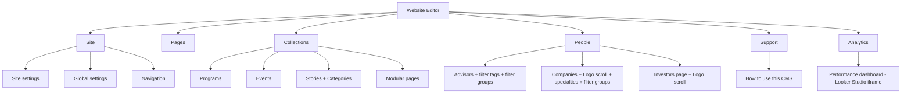

# Rellia Web Studio — CMS rebuild blueprint (v2)

Ultra-minimalist, editor-first Sanity Studio for the Rellia marketing site. Builds on [sanity-cms-audit-and-rebuild-plan.md](./sanity-cms-audit-and-rebuild-plan.md).

## Branding

| Setting | Value |
|---------|--------|
| Studio project title (`sanity.config.ts` → `title`) | **Rellia Web Studio** |
| Structure drawer header (`deskStructure` → `S.list().title`) | **Website Editor** |

## Sidebar (editor-first)



**No top-level Taxonomy tab.** Filter tags and filter groups live under **People → Advisors** and **People → Founders**, separated by dividers from the main lists.

**Logo scroll (marquee):** Under **People → Investors** (`networkInvestorsPage.logoMarquee` — add/remove/reorder logos). Under **People → Founders**, add the same `logoMarquee` field to `networkFoundersPage` for the alumni/portfolio scroll (today hardcoded on the site).

**Page visibility:** Every routed page singleton gets `pageVisibility`: `live` | `hidden` | `placeholder`, plus optional placeholder title/message/CTA. Frontend renders a simple placeholder layout or 404 when not live.

## Plugins (minimal)

| Concern | Approach |
|---------|----------|
| Core | `structureTool`, `presentationTool`, `@sanity/vision` only |
| SEO | [`sanity-plugin-seofields`](https://www.npmjs.com/package/sanity-plugin-seofields) (Desai Hardik) — character-count hints, SERP preview; migrate from custom `seo` object in a dedicated phase |
| Analytics | **No** `sanity-plugin-ga-dashboard`, **no** Express/Google Cloud proxy. Native Studio panel: full-height **Looker Studio** `<iframe>` via `SANITY_STUDIO_LOOKER_EMBED_URL` |

## Sections rule (Phase 3)

- Single system: **`section*`** types rendered by [`PageRenderer.tsx`](../client/components/cms/PageRenderer.tsx).
- Retire unused `pageBuilder` / `heroSection` types from editor menus after migration.
- **Every** section object must have `internalLabel` and/or a strong `preview` (e.g. `Hero: Summer Launch`, not generic `Section: Hero`).
- GROQ + [`shared/cms/types.ts`](../shared/cms/types.ts) must treat `sections[]` as the canonical layout shape so future frontend changes stay in one renderer.

## Implementation order

| Phase | Focus |
|-------|--------|
| **1** | Desk structure, rebranding, navigation list UX, document previews (People + Collections) |
| **2** | Shared field hints (word counts, minimal descriptions) |
| **3** | Unify `sections` on pages; expand allowed types; wire GROQ + frontend |
| **5** | **Presentation / Visual Editing / stega** — **after Phase 3** so preview overlays match final schema |
| **4** | Careers open roles → `careersPage` + seed migration |
| **6** | Expand Support docs (publishing, datasets, Presentation) |
| **7** | SEO plugin integration + replace custom `seo` fields where appropriate |
| **8** | Legacy field cleanup |

## Data safety & seeding (before schema breaks)

1. **Audit** current `preview` / `production` dataset content (export or Vision snapshot) before dropping fields.
2. Update [`scripts/sanity-seed.ts`](../scripts/sanity-seed.ts) to:
   - Seed restructured singletons and modular pages
   - Migrate [`shared/careersOpenRoles.ts`](../shared/careersOpenRoles.ts) into `careersPage.openRoles`
   - Preserve existing copy where document IDs are stable (`homePage`, `navigation`, etc.)
3. Run seed against **preview** first; validate site; then promote or patch production.

## Presentation troubleshooting (Phase 5)

Prerequisites: `SANITY_STUDIO_PREVIEW_URL`, `SANITY_API_READ_TOKEN`, matching datasets, [`VisualEditingOverlay`](../client/components/sanity/VisualEditingOverlay.tsx), draft-mode routes in [`server/index.ts`](../server/index.ts). WebSocket warnings in Studio console are often non-fatal; fix **“Unable to connect to visual editing”** via env + stega + iframe origin alignment.

---

## Legacy detailed sections

The sections below retain earlier technical notes. Prefer the v2 blueprint above for execution order and constraints.

# Sanity CMS Rebuild & Layout Guide (legacy detail)

This document outlines the architecture, current state, and step-by-step implementation guide to refactor the Rellia Sanity CMS. The goal is to provide a highly flexible, client-friendly experience that supports visual editing, dynamic section reordering, formatted text controls, and reusable content blocks.

---

## 1. Current Sanity Architecture & Setup

### 1.1 Dataset Architecture & Linking
The project uses two primary datasets to separate draft/staging content from production:

1. **`preview` Dataset**: 
   * **Purpose**: Serves as the database for the staging site (`relliahealth.vercel.app`), local development, and the Sanity Studio default interface.
   * **Visual Editing**: Connected to Sanity's `presentationTool`.
2. **`production` Dataset**: 
   * **Purpose**: Serves as the database for the live public site (`www.relliahealth.com`).
   * **Promotion/Syncing**: Content is synced from `preview` to `production` using the sync script located at `scripts/promote-preview-to-production.ts`. Running `pnpm sanity:promote -- --apply-production` pushes approved events, categories, and documents to production.

### 1.2 Frontend Query Flow (Security Model)
To prevent exposure of Sanity API keys or complex queries in the browser, the project uses a secure query proxy:
* **The Client**: Instead of executing raw GROQ, the client sends a `queryId` and parameters (validated by Zod) to the Express endpoint `POST /api/sanity/query` (implemented in `server/index.ts`).
* **The Server**: Selects the appropriate dataset based on the environment (using `server/sanityEnv.ts` with Vercel deployment checks).
  * In **Preview/Staging mode**: Configures the client with `perspective: "drafts"` and `stega: { enabled: true }` (essential for Visual Editing click-to-edit metadata overlays).
  * In **Production mode**: Queries the `production` dataset with published-only visibility.
* **Sanitization**: The server strips database metadata (`_id`, `_rev`, `_ref`) in `server/sanityResponseSanitize.ts` to keep the client bundles clean, while retaining `_type` and `_key` for component rendering.

---

## 2. Current Schema Audit: The "Mess" Signals

The current schema folder (`website-cms/schemaTypes`) has several architectural inconsistencies:

### 2.1 Fragmented Section Systems
There are currently two competing section layouts in the codebase:
1. **The Legacy `section*` System** (Rendered on Frontend):
   * Objects: `sectionHero`, `sectionRichText`, `sectionCardsGrid`, `sectionEligibilityBento`, `sectionFeatureGrid`, `sectionEngageBand`, `sectionJourneyTimeline`, `sectionDiagnosticSurvey`.
   * Fully supported in `client/components/cms/PageRenderer.tsx` and queried inside `shared/cms/groqQueries.ts`.
2. **The New `pageBuilder` System** (Unused on Frontend):
   * Objects: `heroSection`, `featuresSection`, `contentSection`, `carouselSection`, `testimonialSection`.
   * Defined inside `website-cms/schemaTypes/objects/pageBuilder/` and registered in `schemaTypes/index.ts`.
   * **Issue**: The frontend has no rendering logic for these types, and modular pages (`page.ts`) do not include them. If editors select them in Sanity Studio, they break or render nothing on the site.

### 2.2 Singleton Field Sprawl
Documents like `homePage.ts` and `aboutPage.ts` are modeled with rigid, bespoke static schemas (`headlinePrefix`, `subheadline`, `metricsHeading`, `whyFeatures` list, etc.) instead of modular blocks.
* **Pain Point**: Clients cannot swap the order of the sections, insert a CTA banner between sections, or reuse common layouts (e.g. a FAQ block or testimonials slider) without code modifications.

### 2.3 Deprecated/Legacy Fields
Entities like `advisor.ts` and `alumniCompany.ts` contain hidden or legacy fields (e.g., hidden `roleTitle` and `avatar` fields on advisors; legacy primary category tags) that clutter the database and schema definitions.

---

## 3. Rebuild Blueprint for a Client-Friendly CMS

To resolve this mess, we must standardize on **one page composition system**, introduce **reusable referenced blocks**, and optimize the editor UX.

### 3.1 Unify the Page Builder
Standardize on the `section*` system since it is already integrated with the frontend React components.

#### Schema Changes (`website-cms/schemaTypes/documents/page.ts`)
Update the modular page document to support all current section types:
```typescript
import { defineArrayMember, defineField, defineType } from 'sanity'

export const page = defineType({
  name: 'page',
  title: 'Page',
  type: 'document',
  groups: [
    { name: 'content', title: 'Content', default: true },
    { name: 'seo', title: 'SEO & Metadata' },
  ],
  fields: [
    defineField({
      name: 'title',
      type: 'string',
      validation: (Rule) => Rule.required(),
      group: 'content',
    }),
    defineField({
      name: 'slug',
      type: 'slug',
      options: { source: 'title', maxLength: 96 },
      validation: (Rule) => Rule.required(),
      group: 'content',
    }),
    defineField({
      name: 'sections',
      title: 'Page Sections',
      description: 'Drag, drop, and reorder sections to build the page layout.',
      type: 'array',
      group: 'content',
      of: [
        defineArrayMember({ type: 'sectionHero' }),
        defineArrayMember({ type: 'sectionRichText' }),
        defineArrayMember({ type: 'sectionCardsGrid' }),
        defineArrayMember({ type: 'sectionEligibilityBento' }),
        defineArrayMember({ type: 'sectionFeatureGrid' }),
        defineArrayMember({ type: 'sectionEngageBand' }),
        defineArrayMember({ type: 'sectionJourneyTimeline' }),
        defineArrayMember({ type: 'sectionDiagnosticSurvey' }),
        // Reference to reusable sections
        defineArrayMember({ 
          type: 'reference',
          name: 'reusableSectionRef',
          title: 'Reusable Section Reference',
          to: [{ type: 'reusableSection' }] 
        }),
      ],
    }),
    defineField({
      name: 'seo',
      type: 'seo',
      group: 'seo',
    }),
  ],
})
```

### 3.2 Implement Reusable Section Objects
To allow clients to define a section once (e.g., a Testimonials Carousel, an Advisory CTA) and render it on multiple pages:

1. **Create the Schema (`website-cms/schemaTypes/documents/reusableSection.ts`)**:
   ```typescript
   import { defineField, defineType } from 'sanity'
   import { SquareIcon } from '@sanity/icons'

   export const reusableSection = defineType({
     name: 'reusableSection',
     title: 'Reusable Section',
     type: 'document',
     icon: SquareIcon,
     fields: [
       defineField({
         name: 'title',
         title: 'Internal Title',
         description: 'Used to identify this section in the studio.',
         type: 'string',
         validation: (Rule) => Rule.required(),
       }),
       defineField({
         name: 'section',
         title: 'Section Content',
         type: 'object',
         // Allow any of the standard section types
         fields: [
           defineField({
             name: 'content',
             type: 'array',
             of: [
               { type: 'sectionHero' },
               { type: 'sectionRichText' },
               { type: 'sectionCardsGrid' },
               { type: 'sectionEligibilityBento' },
               { type: 'sectionFeatureGrid' },
               { type: 'sectionEngageBand' },
               { type: 'sectionJourneyTimeline' },
               { type: 'sectionDiagnosticSurvey' },
             ],
             validation: (Rule) => Rule.max(1).required(),
           })
         ]
       })
     ],
     preview: {
       select: { title: 'title', sectionType: 'section.content.0._type' },
       prepare({ title, sectionType }) {
         return {
           title,
           subtitle: `Reusable: ${sectionType ? sectionType.replace('section', '') : 'Empty'}`
         }
       }
     }
   })
   ```

For the full historical audit, see [sanity-cms-audit-and-rebuild-plan.md](./sanity-cms-audit-and-rebuild-plan.md).
